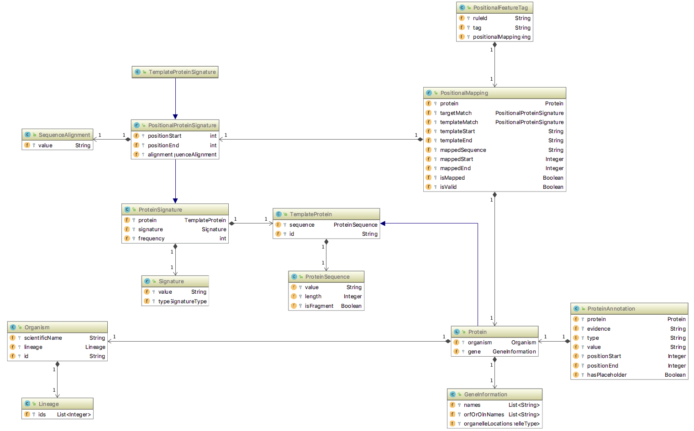

# UniFIRE Project

UniFIRE (The UniProt Functional annotation Inference Rule Engine) is an engine to execute rules in the UniProt Rule
 Markup Language (URML) format. It can be used to execute the UniProt annotation rules (UniRule and ARBA).

This project is a work in progress, open for collaboration.

Introducing presentation: [UniFIRE-URML.pptx](misc/media/UniFIRE-URML.pptx)

There are two different ways to run UniFIRE:
1. **Downloading and running the UniFIRE *Docker* image**<br/> The UniFIRE Docker image allows to run the whole UniFIRE
 workflow including all dependencies like InterProScan and HMMER with a single command. The only necessary
  software dependency is an installation of Docker.
 Therefore we recommend this way of running UniFIRE to new users.
 Because the large InterProScan package and its dependencies are included in the Docker image, a user
  needs to download ~25 GB and allow ~100 GB disk space on the system. <br/><br/> 
2. **Running UniFIRE after building it from its source**<br/>
 This way requires more manual interaction of the user. Each step of a UniFIRE workflow has to
 be executed separately or combined by a script. Also some steps require external software like InterProScan or HMMER,
 which may need to be installed by the user separately or started through a web-interface. Therefore we recommend this
 approach to advanced users who would like to create a particular workflow, e.g. who would like to run the heavy
 InterProScan within a separate procedure.
 
This documentation uses scripts and sample data which are provided by the UniFIRE Gitlab repository. Therefore please
 make sure you have checked out a local copy of UniFIRE Gitlab repository. This is done by the
 command below, which requires git to be installed on your system:
```
git clone https://gitlab.ebi.ac.uk/uniprot-public/unifire.git
```

## 1. Using the Docker image

### Prerequisites
#### Hardware
A machine with at least 4 GB of memory (8 GB or more recommended) and ~100 GB of available disk space.

#### Operating system support
The Docker image is expected to run on any operating system 

#### Software
A recent version of Docker is necessary to start the UniFIRE docker image as a new container. It has been tested
 successfully on Ubuntu 24.04 and Docker version 23.0.6.

### Data preparation
The only input data that need to be provided are the protein sequence data in multi-FASTA format for which 
 functional predictions should be created. The FASTA header needs to follow the UniProtKB conventions 
 ([https://www.uniprot.org/help/fasta-headers](https://www.uniprot.org/help/fasta-headers))
 
 The minimal structure of the header is:
```
>{id}|{name} {flags}
```
* `{id}` must be a unique string amongst the processed sequences
* `{name}`:
    * can be any string starting from the previous separator, that should not contain any flag
    * might contains `(Fragment)` if applicable (e.g "`ACN2_ACAGO Acanthoscurrin-2 (Fragment)`")
* `{flags}` \[mandatory]: to be considered a valid header, only the following flags should be provided:
    * OX=`{taxonomy Id}`
* `{flags}` \[optional]: If possible / applicable, you should also provide:
    * OS=`{organism name}`
    * GN=`{recommended gene name}`
    * GL=`{recommended ordered locus name (OLN) or Open Reading Frame (OLN) name}`
    * OG=`{gene location(s), comma-separated if multiple}` ([cf. organelle ontology](https://www.ebi.ac.uk/ena/WebFeat/qualifiers/organelle.html))

### Usage
```
usage: ./docker/bin/run_unifire_docker.sh -i <INPUT_FILE> -o <OUTPUT_FOLDER> [-t <FILE_TYPE>] [-v <VERSION>] [-w <WORKING_FOLDER] [-c]
          [-s docker|singularity|podman]
    -i: Path to input file (Required). Can be either multi-FASTA file (default) or InterProScan xml file (see -t option).
    -t: Input file type. (Optional), DEFAULT: fasta
        Allowed values:
        fasta: multi-FASTA file with headers in UniProt FASTA header format, containing at least OX=<taxid>
        iprscanxml: InterProScan file in xml format. Each protein should have at least one xref element with 'name' attribute containing OX=<taxid>
    -o: Path to output folder. All output files with predictions in TSV format will be available in this
        folder at the end of the procedure. (Required)
    -v: Version of the docker image to use, e.g. 2020.2. Available versions are listed under
        https://gitlab.ebi.ac.uk/uniprot-public/unifire/container_registry. (Optional), DEFAULT: version defined in version.properties
    -w: Path to an empty working directory.  If this option is not given, then a temporary folder will be
        created and used to store intermediate files. (Optional)
    -c: Clean up temporary files. If set, then all temporary files will be cleaned up at the end of the
        procedure. If no working directory is provided through option -w then the temporary files are cleaned
        up by default
    -s: Container software to be used. (Optional), DEFAULT: docker
        Allowed values:
        docker: Use Docker to run UniFIRE Docker image
        singularity: Use Singularity to run UniFIRE Docker image
        podman: Use Podman to run UniFIRE Docker image
```

### Example

**Warning:** The first time this command is run, it will download the ~25 GB large UniFIRE Docker image from the
docker container registry and extract it on the local machine. Depending on the speed of your network and your CPU
this can take a few hours.

### 1) Fasta input file:

This is a simple example, which shows how to use the UniFIRE Docker image to run the whole UniFIRE workflow on some
 sample protein data.

```bash
./docker/bin/run_unifire_docker.sh -i samples/proteins.fasta -o .
```
This command will use as input the file samples/proteins.fasta which is in multi-FASTA format with the header in
 the format as described above. It will run the whole UniFIRE workflow to predict functional annotations from UniRule
 and ARBA rules. The resulting functional predictions will be written into these files in the current working
 directory:
```
predictions_unirule.out
predictions_unirule-pirsr.out
predictions_arba.out
```

### 2) InterProScan input file:

This is a simple example, which shows how to use the UniFIRE Docker image to run UniFIRE workflow on some
sample interproscan xml data.

```bash
./docker/bin/run_unifire_docker.sh -i samples/input_ipr.fasta.xml -t iprscanxml -o .
```
This command will use as input the file samples/input_ipr.fasta.xml which is in InterProScan xml format with the xref 
name attribute in the format as described above (same fasta header format). It will skip the interproscan step (as it is already given as input) and
run the remaining UniFIRE workflow to predict functional annotations from UniRule and ARBA rules. The resulting 
functional predictions will be written into these files in the current working directory:
```
predictions_unirule.out
predictions_unirule-pirsr.out
predictions_arba.out
```

### Runtime
The application of the UniFIRE Docker image on a complete bacterial proteome with ~4,500 proteins requires
 a runtime of 6 h on an Intel Core i5-4690 CPU with 4 Cores. 98% of this runtime is necessary for the InterProScan
 procedure.
<br/>

### Alternatives to Docker
For various reasons Docker is not a reasonable solution in a multi-user environment like most HPC clusters. Therefore
 alternatives like *Singularity* and *Podman* have been tested to run the UniFIRE Docker image. 

#### Singularity
Instead of Docker, an available Singularity installation can be used to run the UniFIRE docker image. The executable
"singularity" must be available in the PATH environment variable. The UniFIRE Docker image has been tested successfully
with Singularity version 3.6.1.

Because the UniFIRE image is big, you may want to use a folder with enough free disk-space
 (~200 GB) available for temporary and cached files:
```
export SINGULARITY_CACHEDIR=/path/to/cache/folder
export SINGULARITY_TMPDIR=/path/to/tmp/folder
export SINGULARITY_LOCALCACHEDIR=/path/to/localcache/folder
```

Run the Docker image with Singularity:
```
./docker/bin/run_unifire_docker.sh -i samples/proteins.fasta -o . -s singularity
```
    
 
#### Podman
Instead of Docker, an available Podman installation can be used to run the UniFIRE docker image. The executable
"podman" must be available in the PATH environment variable. The UniFIRE Docker image has been tested successfully
with Podman version 2.0.3.

Because the UniFIRE image is big, you may want to use a folder with a larger amount of free disk-space
 (~200 GB) available for temporary and cached files:
```
export TMPDIR=/path/to/tmp/folder
```
Run the Docker image with Podman:
```
./docker/bin/run_unifire_docker.sh -i samples/proteins.fasta -o . -s podman
```

For both cases, Singularity and Podman, the resulting output filder will be located in ${run_folder} with the filenames
```
predictions_unirule.out
predictions_unirule-pirsr.out
predictions_arba.out
```

## 2. Run UniFIRE after building it from its source code

### Prerequisites

#### Hardware

A machine with at least 4 GB of memory (8 GB or more recommended).

#### Operating system support

The Java software is portable for any system.
Scripts are only provided for Linux and Mac OS.

#### Software

- Java 17 (e.g. OpenJDK 17)
- Bash
- Maven (version 3.6.0 has been tested successfully)

### Build
In order to build the software and download the latest rules and templates into the folder samples/ 
please execute below command. 

```
<Path to UniFIRE parent folder>/build.sh
```

Depending on the speed of your internet connection, it will take a few minutes to download all dependencies through 
maven. You will require in total ~500 MB disk space in UniFIRE folder and in your local maven cache. The script also 
downloads the latest UniRule, UniRule-PIRSR and ARBA rules in URML format and UniRule template
alignments in fact XML format from EBI FTP into samples/ folder. Additionally it downloads data neccassary to run
UniRule-PIRSR rules from https://proteininformationresource.org/pirsr/pirsr_data_latest.tar.gz and places them
underneath the folder samples/pirsr_data. 
   
### Usage

We provide some sample files in the [sample](samples) folder to test the software.
<br/>

**Example with UniRule rules & InterProScan XML input:**
``` bash
./distribution/bin/unifire.sh -r samples/unirule-urml-latest.xml -i samples/input_ipr.fasta.xml -t samples/unirule-templates-latest.xml -o output_unirule_annotations.csv
```

*Note: To be able to predict the UniRule positional annotations, a template file is provided (`samples/unirule-templates-2018_05.xml`) (optional.)*
<br/>

**Example with ARBA rules & Fact XML input:**
``` bash
./distribution/bin/unifire.sh -r samples/arba-urml-latest.xml -i samples/input_facts.xml -s XML -o output_arba_annotations.csv
```
<br/>

**Example with PIRSR rules and protein data in InterProScan XML format:**

In order to use UniRule-PIRSR rules to annotate protein input data, alignments of the protein sequences against
 SRHMM signatures need to be calculated in a preparation step. This requires *HMMER*, in particular an
  installation of the executable *hmmalign*. With Ubuntu 18.04 *hmmeralign* can be installed at /usr/bin/hmmalign
   by the command below:
``` bash 
sudo apt-get install hmmer
```
As an alternative, *hmmer* source code can be downloaded from the http://hmmer.org/. In the example below we
 assume hmmalign binary is available at this path on the filesystem: /usr/bin/hmmalign

Running UniRule-PIRSR rules is a two step process:
First, calculate the alignment(s) of your protein(s) against all SRHMM signatures, combine data from the input in
 InterProScan XML format with these alignments and write the output to the Fact XML file PIRSR-input-iprscan-urml.xml:   
``` bash
./distribution/bin/pirsr.sh -i ./samples/pirsr_data/PIRSR-input-iprscan.xml -o . -a /usr/bin/hmmalign -d ./samples/pirsr_data
```
Second run UniFIRE with UniRule-PIRSR rules and PIRSR-templates on the protein data in PIRSR-input-iprscan-urml.xml:
``` bash
./distribution/bin/unifire.sh -r samples/unirule.pirsr-urml-latest.xml  -i ./PIRSR-input-iprscan-urml.xml -s XML -t samples/pirsr_data/PIRSR_templates.xml -o ./pirsr_unifire_annotation.csv
```

_Note_: With all rule systems, it is possible that a protein gets the exact same annotation from different rules due
 to overlap in condition spaces.

#### Options

```
usage: unifire -i <INPUT_FILE> -o <OUTPUT_FILE> -r <RULE_URML_FILE> [-f <OUTPUT_FORMAT>] [-n
       <INPUT_CHUNK_SIZE>] [-s <INPUT_SOURCE>] [-t <TEMPLATE_FACTS>] [-m <MAX_MEMORY>] [-h]
--------------------------------------------
     -i,--input <INPUT_FILE>                Input file (path) containing the proteins to annotate
                                            and required data, in the format specified by the -s
                                            option.
     -o,--output <OUTPUT_FILE>              Output file (path) containing predictions in the format
                                            specified in the -f option.
     -r,--rules <RULE_URML_FILE>            Rule base file (path) provided by UniProt (e.g UniRule
                                            or ARBA) (format: URML).
     -f,--output-format <OUTPUT_FORMAT>     Output file format. Supported formats are:
                                            - TSV (Tab-Separated Values)
                                            - XML (URML Fact XML)
                                            (default: TSV).
     -n,--chunksize <INPUT_CHUNK_SIZE>      Chunk size (number of proteins) to be batch processed
                                            simultaneously
                                            (default: 1000).
     -s,--input-source <INPUT_SOURCE>       Input source type. Supported input sources are:
                                            - InterProScan (InterProScan Output XML)
                                            - UniParc (UniParc XML)
                                            - XML (Input Fact XML)
                                            (default: InterProScan).
     -t,--templates <TEMPLATE_FACTS>        UniRule template sequence matches, provided by UniProt
                                            (format: Fact Model XML).
     -m <MAX_MEMORY>                        Max size of the memory allocation pool in MB (JVM -Xmx)
                                            (default: 4096 MB).
     -h,--help                              Print this usage.
```

***

## Data preparation

This section is a walk through on how to prepare your data, assuming you are starting from scratch: from a set of
 sequences (multifasta) that you would like to annotate.

More advanced users / developers with an existing bioinformatics pipeline already integrating InterProScan results can directly pass the InterProScan file in xml format. Note that the same fasta header format described below applies to the **xref elements name attribute** in the interproscan xml file.

### MultiFasta header format

The MultiFasta headers should, more or less, follow the UniProtKB conventions ([https://www.uniprot.org/help/fasta-headers](https://www.uniprot.org/help/fasta-headers))

The minimal structure of the header is the following:

```
>{id}|{name} {flags}
```

* `{id}` must be a unique string amongst the processed sequences
* `{name}`:
    * can be any string starting from the previous separator, that should not contain any flag
    * might contains `(Fragment)` if applicable (e.g "`ACN2_ACAGO Acanthoscurrin-2 (Fragment)`")
* `{flags}` \[mandatory]: to be considered a valid header, only the following flags should be provided:
    * OX=`{taxonomy Id}`
* `{flags}` \[optional]: If possible / applicable, you should also provide:
    * OS=`{organism name}`
    * GN=`{recommended gene name}`
    * GL=`{recommended ordered locus name (OLN) or Open Reading Frame (OLN) name}`
    * OG=`{gene location(s), comma-separated if multiple}` ([cf. organelle ontology](https://www.ebi.ac.uk/ena/WebFeat/qualifiers/organelle.html))

The UniProt header format has been slightly extended with GL and OG flags.

Optionally, `{id}` can be prepended by `{database}|`, to follow UniProt conventions. If used, it will simply be skipped during the parsing.

Also note that any additional flags will also be ignored.

#### Examples of valid headers:

The standard header used in UniProt:
```
>tr|Q3SA23|Q3SA23_9HIV1 Protein Nef (Fragment) OS=Human immunodeficiency virus 1  OX=11676 GN=nef PE=3 SV=1
```

The standard UniProt header, customized with additional flags:
```
>tr|A0A0D6DT88|A0A0D6DT88_BRADI Maturase K (Fragment) OS=Brachypodium distachyon OX=15368 GN=matK GL=BN3904_34004 OG=Plastid,Chloroplast PE=3 SV=1
```

Customized minimal header:
```
>123|Mystery protein OX=62977
```

Customized full header:
```
>MyPlantDB|P987|Photosystem II protein D1 OS=Lolium multiflorum OX=4521 GN=psbA GL=LomuCp001 OG=Plastid
```

### Fetching the full lineages

From the previously described header format, you can use the following script to fetch the full NCBI taxonomy id lineage. The script has dependency on NCBITaxa python package (ete4).

* python [./misc/taxonomy/updateIPRScanWithTaxonomicLineage.py](misc/taxonomy/fetchLineageLocal.py) `-i <input>` `-o <output>`

The script will simply replace the OX={taxId} by OX={fullLineage} in the xref name attribute.

Having the full lineage is necessary for the majority of the rules to be executed.

### Validating the MultiFasta file

If you want to ensure the headers are in the correct format, you can run the following script:

``` bash
./distribution/bin/fasta-header-validator.sh multifasta_sequences.fasta
```

You will get an error message if at least one sequence's header is invalid.
The script also print out warnings if an important data (e.g organism name) is missing. The warnings can be ignored.

### Running InterProScan

Once the multifasta file is ready (cf. previous steps), you can find the matches of all sequences using InterProScan.
It is advised to download the last version from [https://www.ebi.ac.uk/interpro/download.html](https://www.ebi.ac.uk/interpro/download.html) and keep it up-to-date.

The output format must be XML to be accepted as a valid input for UniFIRE.

The option `-dp` or `--disable-precalc` must be used to be able to get the sequence alignments (necessary if you are interested in the positional features annotations provided by UniRule).

Command:

``` bash
./interproscan.sh -f xml -dp -i multifasta_sequences.fasta --appl "Hamap,ProSiteProfiles,ProSitePatterns,Pfam,NCBIFAM,SMART,PRINTS,SFLD,CDD,Gene3D,PIRSF,PANTHER,SUPERFAMILY"
```

#### Analyses to run

* Hamap
* ProSiteProfiles
* ProSitePatterns
* Pfam
* NCBIfam
* SMART
* PRINTS
* SFLD
* CDD
* Gene3D
* ProDom
* PIRSF
* PANTHER
* SUPERFAMILY

It is possible to include/exclude some of the analyses by modifying the `--appl` option in the above command. UniFIRE will still be able to process the data. 
By excluding some of those analyses, some rules might not be triggered as a result.

If you do not wish to install InterProScan, you can use the [online version](https://www.ebi.ac.uk/interpro/search/sequence-search) and then download the results in XML.
The only limitation is that the online version does not provide the sequence alignments for the matches, making the execution of UniRule positional features impossible (non-positional rules will still be executed).

### Running UniFIRE

Once you get the InterProScan output (by default, it is the name of the input file, appended with .xml), you can use it as a input for UniFIRE (e.g `--input multifasta_sequences.fasta.xml`).

***

## Developer guide

### Fact Model

The fact model is automatically created from the following XML Schema: [urml-facts.xsd](core/src/main/resources/schemas/xsd/urml-facts.xsd)

The corresponding Java classes are built in the [core](core) module under the package `org.uniprot.urml.facts`, after building the project with Maven (or using the `./build.sh` script).

You can use theses classes (described in the UML diagram below) and the container `org.uniprot.urml.facts.FactSet` to load your own data directly into objects (via an ORM or a custom parser).

### Fact Model Diagram



### Rule Model

The rule model is described in another XML Schema available here: [urml-rules.xsd](core/src/main/resources/schemas/xsd/urml-rules.xsd)  

The corresponding Java classes are built in the [core](core) module under the package `org.uniprot.urml.rules`.

### Building the software

#### Requirement

- Maven (>= 3.0)
- Java (>=11 required, cf. limitations)

Please make sure your JAVA_HOME environment variable points to the root folder of your JDK 11 installation, e.g.

```
export JAVA_HOME=/usr/lib/jvm/java-11-openjdk-amd64
```
#### Command

``` bash
./build.sh
```

This script is installing some libraries in your local maven repository (temporary solution before publishing the artifacts on a public repository).

Then it runs `mvn clean install`, assembling all the libs and the execution script under `./distribution/target/unifire-distribution/`.

To use the newly built distribution, you will need to run: `./distribution/target/unifire-distribution/bin/unifire.sh` instead.


### Execution

The execution of the rules relies on [Drools](https://www.drools.org), an open-source rule-based technology developed by RedHat. 
It is using an optimized version of the [Rete algorithm](https://en.wikipedia.org/wiki/Rete_algorithm) to match facts and rules in a scalable way.
This tool translates the URML rules into the Drools language, converts the input data according to the rule model and execute all the rules to produce a list of protein annotations.  

***

## Limitations

### Memory
A minimum of 8 GB of memory is recommended for this software to run. By default, the JVM max heap space is configured to use 75% of the available memory. 
For a large number of protein to process, it is advised to split them into chunks of approx. 500 proteins per rule evaluation to keep the memory usage low.
This is automatically handled by the `-n / --chunksize` option of UniFIRE (by default 500).  
In case you face OOM heap space memory errors, try to manually split the input file into smaller chunks, or use a machine with more memory.

### Java 9 / 10 issues

- For users, the software will be functional under Java 9 or 10, but you will get some warning messages complaining about illegal reflective accesses. You can simply ignore them at the moment.
- For developers, building the software with JDK 9 / 10 is currently not possible because of JAXB Maven plugin issues. Cf:

    * https://github.com/highsource/maven-jaxb2-plugin/issues/120
    * https://stackoverflow.com/questions/49717155/failed-to-run-custom-xjc-extension-within-cxf-xjc-plugin-on-java-9

    Those issues have been raised very recently. The fixes will be applied as soon as there are available.

***

## Issues & Suggestions

If you have any questions regarding this software, if you experience any bugs or have suggestions for improvements on
 the software, the models, the helper scripts, the documentation, etc, please contact us through the UniFIRE mailing
  list
  
  * **UniFIRE Mailing List** - [unifire@ebi.ac.uk](mailto:unifire:ebi.ac.uk)


## Authors

* **Alexandre Renaux**
* **Chuming Chen**
* **Hermann Zellner**
* **Vishal Joshi**

## Contact

* **UniProt Help** - https://www.uniprot.org/contact
